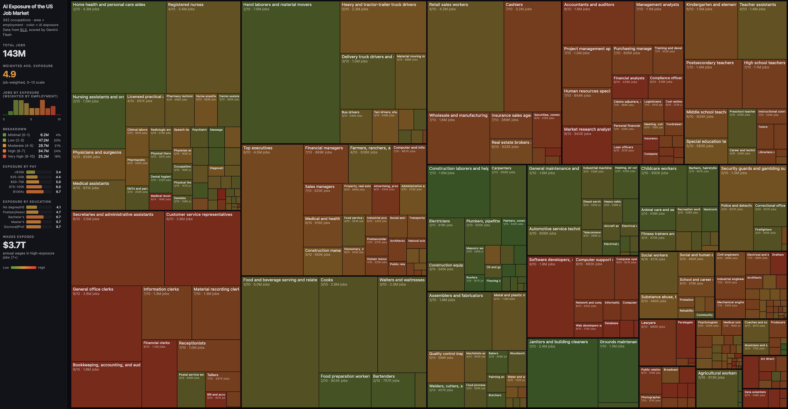

# Türkiye İş Gücü — YZ Maruziyeti

Türkiye iş gücü piyasasındaki mesleklerin yapay zeka ve otomasyona maruziyetini analiz eder.

[Karpathy'nin AI Jobs](https://github.com/karpathy/jobs) projesinin Türkiye adaptasyonudur.

**Canlı demo: [alpozcan.github.io/jobs-turkey](https://alpozcan.github.io/jobs-turkey/)**



## İçindekiler

- [Proje Özeti](#proje-özeti)
- [Veri Kaynakları](#veri-kaynakları)
- [Puanlama Metodolojisi](#puanlama-metodolojisi)
- [Çalıştırma](#çalıştırma)
- [Dosya Yapısı](#dosya-yapısı)
- [Katkıda Bulunma](#katkıda-bulunma)
- [Lisans](#lisans)

## Proje Özeti

**117 meslek**, 18 kategori altında analiz edildi. Her meslek 0–10 arasında YZ maruziyet skoru aldı. İnteraktif treemap'te alan = istihdam sayısı, renk = YZ maruziyeti (yeşil = güvenli, kırmızı = yüksek risk). Renk paleti renk körü dostu seçilmiştir.

Herhangi bir mesleğe tıklayarak detaylı analiz dialogunu açabilirsiniz:
- Skor göstergesi ve seviye etiketi
- Aylık ücret, istihdam, eğitim ve kategori karşılaştırması
- YZ maruziyet analizi ve akademik referanslarla desteklenen gerekçesi
- Tahmini faktör dağılımı (dijitallik, rutinlik, fiziksellik, yaratıcılık, insan etkileşimi)
- Çoklu kaynaklı ücret karşılaştırması (Önceki Yazılımcı, Levels.fyi, yazilimcimaaslari.org)
- Benzer meslekler (tıklanabilir)
- Akademik referanslı ekonomik etki hesaplaması

## Veri Kaynakları

### Kaynaklar

| Kaynak | Açıklama |
|--------|----------|
| [Önceki Yazılımcı 2025](https://github.com/oncekiyazilimci/2025-yazilim-sektoru-maaslari) | 9.056 teknoloji sektörü maaş anketi (JSON) |
| [Levels.fyi Turkey](https://www.levels.fyi/t/software-engineer/locations/turkey) | 327 yazılım mühendisi maaş verisi |
| [yazilimcimaaslari.org](https://yazilimcimaaslari.org) | 1.223 katılımcılı yazılım maaş anketi (2026) |
| [@maashesabi](https://x.com/maashesabi) | Anonim maaş DM'leri (ek veri) |

### Resmi Kaynaklar

| Kaynak | Açıklama |
|--------|----------|
| [TÜİK İşgücü İstatistikleri](https://data.tuik.gov.tr) | İstihdam sayıları, ücret verileri |
| [TÜİK Kazanç Yapısı Araştırması](https://data.tuik.gov.tr/Bulten/Index?p=Kazanc-Yapisi-Istatistikleri-2023-53700) | Meslek gruplarına göre brüt/net kazanç |
| [İŞKUR Meslek Bilgi Bankası](https://esube.iskur.gov.tr/Meslek/MeslekleriTaniyalim.aspx) | 1.123 meslek tanımı, ISCO-08 kodları |
| [SGK İstatistik Yıllıkları](https://www.sgk.gov.tr/Istatistik/Yillik/) | Kayıtlı istihdam ve prim verileri (2007–2024) |

### Kalibrasyon Verileri (HuggingFace)

| Dataset | Açıklama |
|---------|----------|
| [Anthropic/EconomicIndex](https://huggingface.co/datasets/Anthropic/EconomicIndex) | 756 meslek için gözlemlenen YZ maruziyeti, otomasyon olasılıkları |

Tüm kaynakların detaylı listesi için [DATASETS.md](DATASETS.md), akademik referanslar için [REFERENCES.md](REFERENCES.md) dosyasına bakın.

## Puanlama Metodolojisi

Her meslek, YZ maruziyetini ölçen 0–10 arasında bir puan alır:

| Puan | Seviye | Örnekler |
|------|--------|----------|
| 0–1 | Minimal | Çiftçi, itfaiyeci, inşaat işçisi |
| 2–3 | Düşük | Elektrikçi, hemşire, garson |
| 4–5 | Orta | Öğretmen, polis, veteriner |
| 6–7 | Yüksek | Avukat, muhasebeci, pazarlamacı |
| 8–9 | Çok yüksek | Yazılımcı, grafik tasarımcı, çevirmen |
| 10 | Maksimum | Veri giriş elemanı |

Puanlama üç aşamada yapılır:
1. **Sezgisel skorlar** — meslek özelliklerine dayalı başlangıç puanları (`generate_preview_scores.py`)
2. **Kalibrasyon bağlamı** — Anthropic/EconomicIndex verisinden gözlemlenen YZ kullanım oranları ve otomasyon olasılıkları çıkarılır (`calibrate.py`)
3. **LLM puanlaması** — meslek açıklaması, kalibrasyon bağlamı ve Türkiye'ye özgü rubrik birlikte LLM'e gönderilir (`score.py`). Varsayılan model Gemini Flash'tır; mevcut skorlar Claude Opus 4.6 ile üretilmiştir.

Her gerekçe Frey & Osborne (2017), Eloundou ve ark. (2024), Goldman Sachs (2023) gibi hakemli araştırmalara atıfla desteklenmektedir.

## Çalıştırma

```bash
# 1. Sezgisel skorlarla önizleme
python generate_preview_scores.py
python build_site_data.py

# 2. Kalibrasyon bağlamını oluştur (HuggingFace verileri indirilir, sonra silinir)
pip install huggingface_hub
python calibrate.py

# 3. LLM ile puanlama (OpenRouter API anahtarı gerekli)
#    OPENROUTER_API_KEY ortam değişkenini .env'ye ekleyin
python score.py --model google/gemini-3-flash-preview

# 4. Site verisi oluştur ve yerelde çalıştır
python build_site_data.py
cd site && python -m http.server 8000
```

## Dosya Yapısı

```
├── occupations.json           # 117 Türkiye mesleği (ISCO-08 kodlu)
├── occupations.csv            # İstihdam, ücret, eğitim verileri
├── scores.json                # YZ maruziyet skorları (0–10) ve gerekçeler
├── calibration_context.json   # HuggingFace'den çıkarılan kalibrasyon verileri
├── score.py                   # LLM puanlama (Türkiye'ye özgü prompt)
├── calibrate.py               # HuggingFace verilerinden kalibrasyon bağlamı çıkarma
├── generate_preview_scores.py # Sezgisel skor üretici
├── build_site_data.py         # CSV + skorlar → site/data.json
├── DATASETS.md                # 17 veri kaynağının detaylı listesi
├── REFERENCES.md              # 13 akademik referans (DOI'li)
├── sources/
│   └── onceki_yazilimci_2025.json  # 9.056 teknoloji sektörü maaş verisi
└── site/
    ├── index.html             # İnteraktif treemap (Türkçe, erişilebilir, renk körü dostu)
    ├── about.html             # Metodoloji ve proje hikayesi
    └── data.json              # Frontend verisi
```

## Katkıda Bulunma

PR'lar açıktır. Özellikle:
- Yeni meslek eklemeleri
- Daha iyi maaş/istihdam verileri
- TÜİK/İŞKUR/SGK verilerinin entegrasyonu
- Ek HuggingFace veri setleri ile kalibrasyon

## Lisans

Bu proje [arosstale/jobs](https://github.com/arosstale/jobs) deposunun fork'udur. Orijinal proje [Karpathy'nin jobs](https://github.com/karpathy/jobs) çalışmasının açık kaynak yeniden uygulamasıdır.
